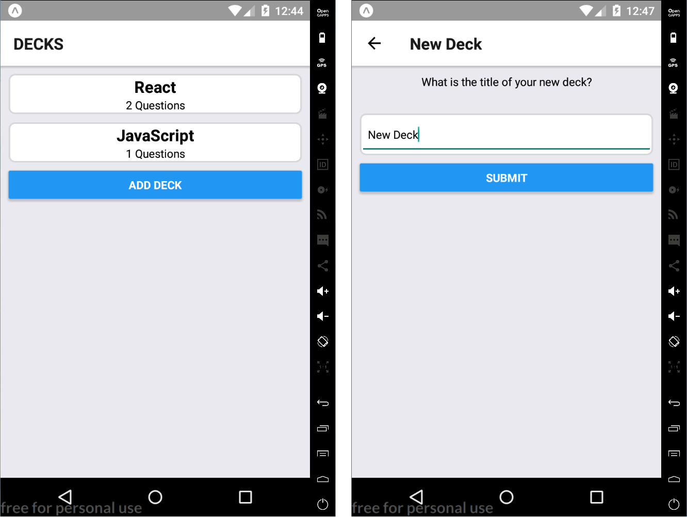
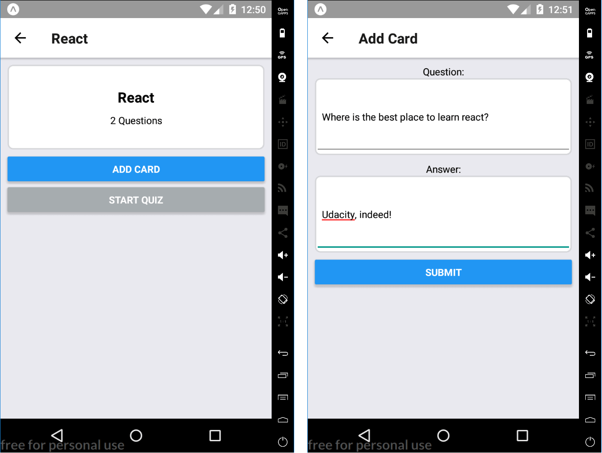
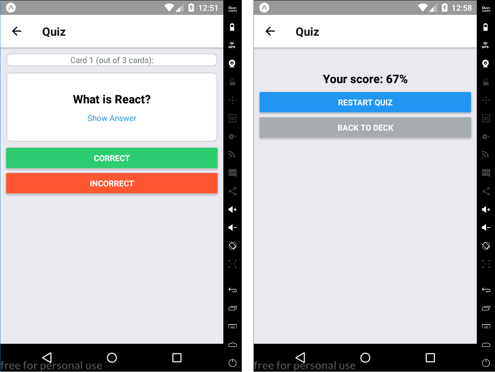

# Mobile Flashcards (UdaciCards)

* UdaciCards is a simple mobile application (_tested on Android_)
that allows users to study collections of flashcards.
* The app will allow users to create different categories of flashcards
called **decks**, add flashcards (henceforth simply **card**) to those decks,
then take **quizzes** on those decks.
* Users are not able to delete or edit decks nor cards.
* The app reports quiz score but does not store it. Although, user will recieve a notification
at `8:00 p.m.` if they did not a quiz on that day.

## Installation

This repository includes the source code bootstrapped with `react-native-app`.

To get started:

- `cd mobile-flashcards`
- `npm install` or `yarn install`
- `npm start` or `yarn start`

## Screenshots

* Browse Decks

* Add a new card

* Take quiz

## Known Issues

### Navigating with `react-native-navigation`

To reproduce the error:

1. Open the App
2. Press "Add Deck" (you will be taken to "Add Deck" view)
3. Write a title and press "SUBMIT" (you will taken to "Individual Deck" view) 
4. Press on "<-" icon on top left of the screen in the navigator header.

* Erroneous behaviour: you will be taken back to the "Add Deck" view
* Expected behaviour: you should have been taken back to the "Deck List" view.

## Contributing

This is my submission for the final assessment project for Udacity's React Native course, developed by [React Training](https://reacttraining.com).
Therefore, I will not accept pull requests.
